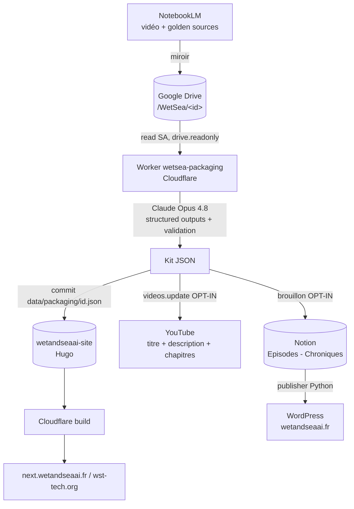

# Architecture — technique & fonctionnelle

## 1. Vue fonctionnelle

**Objectif** : transformer une vidéo (`@wetseatech`) et ses sources validées en un
**kit d'habillage** rigoureux, puis le publier de façon cohérente sur trois
surfaces — **YouTube**, le site **Hugo**, et le blog **WordPress**.

**Acteurs**
- **Éditeur** : prépare brief + sources (NotebookLM → miroir Drive).
- **Concepteur** : définit le canon éditorial (CLAC, taxonomie, schéma).
- **Administrateur** : déploie, active les sorties par paliers, supervise.
- **Utilisateur** : consomme le contenu publié.

**Principe de sûreté** : chaque écriture externe est **opt-in** (dry-run par
défaut) ; le contenu WordPress passe par un **brouillon** relu avant mise en ligne.

## 2. Flux

## 3. Vue technique

### Composants

| Composant | Rôle | Fichier / lieu |
|---|---|---|
| **Worker + cron + routes** | point d'entrée (`/run`, `/publish`, `scheduled`) | `src/index.ts` |
| **PackagingWorkflow** | pipeline complet, étapes durables | `src/workflow.ts` |
| **PublishWorkflow** | batch rétroactif (YouTube + Notion) | `src/publish-workflow.ts` |
| **Drive reader** | JWT service account → lecture brief/sources | `src/drive.ts` |
| **Générateur** | Claude Opus 4.8, structured outputs, retry-on-validation | `src/generator.ts` |
| **Schéma + marque** | Zod + invariants `BRAND` | `src/schema.ts` |
| **Validateur** | règles dures (longueurs, chapitres, intégrité) | `src/validator.ts` |
| **Sorties** | GitHub (Hugo), YouTube, Notion | `src/github.ts`, `src/youtube.ts`, `src/notion.ts` |
| **Publisher** | Notion → WordPress (existant, Python) | dépôt `chroniques-...-publisher` |

### Modèle d'authentification (un par sortie)

| Sortie | Auth | Pourquoi |
|---|---|---|
| Drive (lecture) | service account, scope `drive.readonly` | headless, périmètre minimal |
| YouTube (écriture) | **OAuth propriétaire** (refresh token, `youtube.force-ssl`) | un SA ne peut pas gérer une chaîne perso |
| Hugo (commit) | PAT GitHub `Contents:write` | écriture ciblée sur le dépôt site |
| Notion (brouillon) | token d'intégration | accès à la base Chroniques |
| WordPress | application password (côté publisher) | API REST WordPress |

### Isolation

Le pipeline s'exécute dans un **conteneur éphémère** (invocation Worker) :
secrets injectés au runtime, jamais persistés ; egress restreint aux hôtes
nécessaires (`*.googleapis.com`, `api.github.com`, `api.notion.com`,
`wetandseaai.fr`, `api.anthropic.com`). Voir `../ENVIRONMENT.md`.

## 4. Données

- **Contrat Drive** : `/WetSea/<videoId>/{brief.md, sources.json}` (voir
  `editeur.md`).
- **Kit** : objet JSON strict (`titre`, `hook_intro`, 3 `faits_marquants`
  étiquetés, `ecran_de_fin_cta`, `sources_or`, `chapitrage_youtube`) + invariants
  de marque. Exemples : `examples/pilot_kits.json`.
- **Mapping Notion** : `Titre`, `ID_Episode` (URL YouTube), `Synopsis`,
  `Content` (corps), `references`, `Statut` ; corps écrit **aussi en blocs** pour
  couvrir les deux versions du publisher.

## 5. Décisions structurantes

1. **NotebookLM n'est pas une dépendance runtime** (pas d'API, mur d'auth) →
   contrat via **miroir Drive**, lu par une API stable.
2. **Structured outputs ⟂ citations** (exclusifs dans un même appel) → la carte
   source→fait vient du `sources.json` curé, pas de l'API citations.
3. **Sûr par défaut** : sorties externes opt-in, WordPress via brouillon relu.
4. **Deux CMS canoniques** (Hugo *et* WordPress) → fan-out assumé, chacun avec
   sa chaîne.
5. **TypeScript** : imposé par le runtime Workers ; SDK Anthropic TS compatible.
